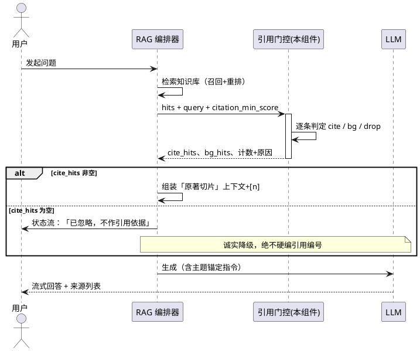
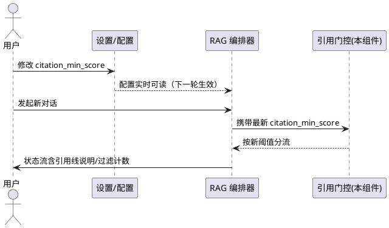
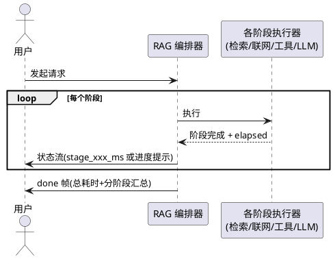

# 需求规格：弱相关引用门控调参（T3 / ISSUE-03）

> 任务：T3「弱相关引用门控调参」
> 关联 Issue：`docs/agents/dispatch/issues/ISSUE-03-citation-gate-tune.md`
> 关联专项：「中后端均匀提速」专项要求
> 需求格式：EARS（Ubiquitous / State / Event / Where / Unwanted），每条带可验证验收条件
> 状态：待用户评审

---

# **1. 组件定位**

## **1.1 核心职责**
本组件负责对检索命中的本地切片执行**主题重叠 + 相关度门控**判定，将其分流为「可引用 [n] / 仅背景 / 丢弃」三类，实现弱相关与偏题内容不占据引用位、真正相关资料稳定被引用、空命中时文案诚实。

## **1.2 核心输入**
1. 用户本轮问题 query（来自对话请求，含多轮上下文）。
2. 检索命中的本地切片列表（`SearchHit`，含 `rerank_score` / `vector_score` / `bm25_score` / chunk 正文与标题）。
3. 配置项：`citation_min_score`、`rag_top_k`、重排可用性标志（`reranked`）。

## **1.3 核心输出**
1. `cite_hits`（可引用切片，带递增 [n] 编号，进入 `SourceRef` 与「本地知识库原著切片」上下文块）。
2. `bg_hits`（仅背景切片，无编号、标注「勿作引用」，进入低相关背景块）。
3. 丢弃计数与原因说明（状态流 message / 日志，如「⚠ 命中 N 个分块但重排相关度均低于引用线 X，已忽略」）。
4. 建议后续由下游消费的 GateStats（cites / bg / dropped_by_score / dropped_by_topic 计数）与阶段耗时观测字段。

## **1.4 职责边界**
本组件**不负责**：
- 检索召回算法本身（BM25 分词、RRF 权重、融合模式、rerank 模型选型——归 T13 / B 系列）。
- 查询扩展、上下文检索、知识图谱注入（归 C1/C2/D2/G 系列）。
- 联网搜索的引擎、预算与正文精读（归 T6 / T5）。
- 模型延迟诊断、推荐策略、慢模型换模型建议的交互 UI（归 T5 / T7）。
- WPF 前端展示与交互（归 T7 / T11）。
- 调用引用审计 `audit_answer_citations` 之外的指标/报表（审计逻辑本身复用现有实现）。

---

# **2. 领域术语**

**可引用命中（cite_hit）**
: 同时满足「rerank_score ≥ citation_min_score」与「通过主题重叠检查」的本地切片，被赋予 [n] 编号并进入 SourceRef，作为回答的证据支撑。

**仅背景命中（bg_hit）**
: 未通过门控但仍被保留的本地切片，以「（低相关背景，勿作引用）」标注注入上下文，不占引用编号。
: 备注：与「可引用命中」互斥，是引用位让渡策略的产物（为联网精读结果腾出编号）。

**丢弃（dropped）**
: 因相关度过低或主题不符且无背景栏位时被完全移除的命中。
: 备注：沉默丢弃是禁止行为——每类丢弃必须有可见计数或日志说明（FR-05 / FR-15）。

**重排相关度（rerank_score）**
: cross-encoder 对「问题-切片」对的匹配度分数，sigmoid 归一化到 0-1，是逐条引用门控的唯一分数依据。

**引用门控线（citation_min_score）**
: 配置阈值，用于逐条判定「强(引用) / 中(背景) / 弱(丢弃)」三档。
: 备注：0 = 关闭逐条门控，回退旧组级逻辑（向后兼容红线）。默认 0.45，需真实库回归定稿。

**主题重叠检查（_hit_supports_query）**
: 词法粗判：从 query 提取 ≥2 字符的 token，任一 token 出现在切片正文/标题/来源中即视为有主题重叠。
: 备注：仅词法、非语义，存在误杀与漏杀风险，是调试节的核心关注点。

**免责声明引用（disclaimer-only citation）**
: 答案中以「[[n]] 并未提及 / 与本主题无关」形式出现的编号，不构成证据支撑，审计时须从 evidence_support 排除。

---

# **3. 角色与边界**

## **3.1 核心角色**
- **对话用户**：发起问答，感知引用真实性与门控带来的「无依据」提示，是本功能最终受益方。

## **3.2 外部系统**
- **重排器（Reranker）**：提供 `rerank_score`；不可用或不返回分数时，逐条门控自动关闭并回退组级逻辑。
- **RAG 编排器（rag_answer / rag_answer_stream）**：调用方，消费 cite/bg/drop 分流结果组装上下文与状态流。
- **引用审计（audit_answer_citations）**：下游校验答案中编号的合法性，与门控共同防止「伪造/虚假支持」。

## **3.3 交互上下文**

```plantuml
@startuml
!define RECTANGLE class

actor "对话用户" as U
RECTANGLE "RAG 编排器" as RAG
RECTANGLE "引用门控组件(本组件)" as GATE
RECTANGLE "重排器" as RR
RECTANGLE "引用审计" as AUDIT

U --> RAG : 发起问题
RAG --> GATE : 检索命中列表 + query\n+ citation_min_score
GATE --> RR : 已重排通过的分带\nrerank_score 命中
GATE --> RAG : cite_hits / bg_hits / 丢弃计数+原因
RAG --> AUDIT : 答案文本 + SourceRef
AUDIT --> U : 引用合法性/免责声明标记
@enduml
```

---

# **4. DFX 约束**

## **4.1 性能**
- 门控判定（词法重叠 + 分流）单条命中耗时须 ≤ 5ms，不得成为检索关键路径瓶颈（逐条门控发生 CPU 侧词法计算，无重排额外开销）。
- 因门控产生的追加过滤说明不得使状态流首条消息延迟超过 50ms。

## **4.2 可靠性**
- 门控判定抛异常时须回退为「该命中按可引用处理」；任何情况下严禁因门控故障导致真相关切片被丢（FR-06）。
- 逐条门控仅在「重排可用且全部命中带 rerank_score」时启用；其它情形回退旧组级逻辑，行为与历史版本一致。

## **4.3 安全性**
- 门控相关日志 / 状态流不得出现任何密钥、Token、隐私正文全文（切片引用仅展示来源、页码、标题与相关度数值）。
- 不新增任何文件系统 / 网络 / 危险工具能力。

## **4.4 可维护性**
- 所有过滤动作必须可见：状态流计数或结构化日志（含阈值数值与过滤原因），日志级别可配置为 debug/info。
- 阈值与降级计数需以结构化字段暴露，便于真实库回归脚本解析对比。
- 新增观测字段须向后兼容（旧客户端忽略未知字段）。

## **4.5 兼容性**
- `citation_min_score = 0` 时行为与未引入逐条门控前一致（不启用逐条过滤）。
- 状态流与 done 帧新增字段不影响既有字段语义；`rag_top_k`、`semantic_floor` 等既有配置不改语义。
- 存量知识库无需重建索引 / 重排。

---

# **5. 核心能力**

## **5.1 引用门控分流（cite | background | drop）**

### **5.1.1 业务规则**（EARS 需求：FR-01 ~ FR-07）

1. **FR-01（Ubiquitous）**：系统须将每条带重排分的本地命中切片划分为且仅划分为三类之一——可引用（cite）、仅背景（background）、丢弃（dropped）。
   a. 验收条件：[构造三种命中：高分主题重叠 / 高分主题无关 / 低分] → [分别进入 cite_hits、bg_hits、丢弃路径，互不重叠]
2. **FR-02（Event）**：当一条命中的 `rerank_score ≥ citation_min_score` 且通过主题重叠检查时，系统须将其放入 cite_hits，赋予与展示顺序一致的递增 [n] 编号并进入 SourceRef。
   a. 验收条件：[真实库提问库内概念，命中高分且主题重叠] → [该切片正文出现在引用来源，编号有效且与上下文一致]
3. **FR-03（Event）**：当一条命中的 `rerank_score < citation_min_score` 或未通过主题重叠检查时，系统须不赋予其 [n] 编号；存在背景栏位时降为背景注入并标注「勿作引用」，无背景栏位时丢弃。
   a. 验收条件：[构造与 query 无词汇重叠的高分切片] → [不进 cite_hits、不进 SourceRef]（单测，ISSUE-03 验收 1）
4. **FR-04（Event）**：当全部本地命中均未通过门控且无联网兜底引用时，系统须在状态流显式声明「命中 N 个分块但重排相关度均低于引用线 X（或主题不符），已忽略」，且不得产生任何伪造 [n] 编号。
   a. 验收条件：[真实库问库外概念，无联网] → [无伪造 [n]，出现明确「无依据/未命中」说明]（ISSUE-03 验收 2）
5. **FR-05（State）**：当引用门控处于启用状态时，系统须分别累计「因分数低于阈值（score）降级」与「因主题不符（topic）降级」的计数，并在状态流 message 或结构化日志中可见。
   a. 验收条件：[构造混合失败命中（低分 N 条 + 高分偏题 M 条）] → [状态流/日志出现 ≥2 个可区分的过滤计数]
6. **FR-06（Unwanted）**：当主题重叠检查或门控分流逻辑自身抛异常时，系统须将相关命中视为可引用处理并在日志记录异常，严禁静默丢弃。
   a. 验收条件：[mock _hit_supports_query 抛异常] → [该命中仍进入 sources，日志含门控异常记录]
7. **FR-07（Event）**：当门控导致 cite_hits 为空时，系统须在进入 LLM 生成阶段前完成过滤说明的发送，不得因「看似检索成功、实则无证据」造成生成阶段空等或误导。
   a. 验收条件：[全部被门控场景] → [状态流中「⚠ 检索知识库…」出现在首个 token 之前]

### **5.1.2 交互流程**



### **5.1.3 异常场景**

1. **门控判定异常**
   a. 触发条件：`_hit_supports_query` 或分流逻辑抛错。
   b. 系统行为：按可引用处理该命中，日志记录门控异常（含堆栈级别 debug）。
   c. 用户感知：引用可能比预期宽松，但不出现丢引用；状态流无新增提示（回退安全）。
2. **全部命中被门控且无联网**
   a. 触发条件：库内命中均为低分/偏题，且未开启联网。
   b. 系统行为：注入「未命中」指示，依赖通用知识生成，不注入引用编号。
   c. 用户感知：「⚠ 检索知识库：命中 N 个分块但…已忽略」+ 答案明确「知识库未找到该类信息」。
3. **重排不可用（半重排/无分）**
   a. 触发条件：rerank 关闭或部分命中缺 rerank_score。
   b. 系统行为：逐条门控自动失效，回退旧组级逻辑（weak_score_with_web / very_weak / topic_mismatch）。
   c. 用户感知：行为与历史版本一致，不出现新的过滤文案（向后兼容）。

## **5.2 阈值可配置与生效**

### **5.2.1 业务规则**（EARS 需求：FR-08 ~ FR-10）

1. **FR-08（Where）**：当配置 `citation_min_score > 0` 且重排可用时，系统须启用逐条引用门控；当 `citation_min_score = 0` 或重排不可用时，系统须回退既有逻辑，不得改变存量行为。
   a. 验收条件：[Settings(citation_min_score=0.0)] → [不启用逐条门控，与旧组级逻辑结果一致]
2. **FR-09（Event）**：当用户更新 `citation_min_score` 后，系统须在下一轮对话即生效，无需重启服务；生效阈值须在日志与状态流中可追溯。
   a. 验收条件：[调阈值后发起对话] → [日志/状态流出现当前引用线数值，过滤结果随阈值变化]（ISSUE-03 验收 4）
3. **FR-10（Where）**：当配置启用背景注入时，系统须对背景块注入设上限（条数与字符数二选一限定，默认条数 ≤ rag_top_k 同量级），避免无效长背景拖慢生成。
   a. 验收条件：[构造大量 bg_hits] → [注入上下文总量有界，且低于配置上限]
   b. 验收条件（提速专项交集）：[背景超限] → [超限部分丢弃，背景与引用占比在状态流可见]

### **5.2.2 交互流程**



### **5.2.3 异常场景**

1. **非法阈值配置**
   a. 触发条件：`citation_min_score` 为负数或非数值字符串。
   b. 系统行为：取 0 处理（= 关闭逐条门控），日志告警。
   c. 用户感知：行为回退旧逻辑，不报错阻塞对话（复用 config 既有 sanitize 链）。

## **5.3 空命中与弱相关的诚实表达**

### **5.3.1 业务规则**（EARS 需求：FR-11 ~ FR-12）

1. **FR-11（Event）**：当本地检索无命中或全部被门控时，系统须指示 LLM 采用「本地资料与本轮主题无关 / 知识库未找到」等诚实表述，且不得用编号包装推测。
   a. 验收条件：[无命中 + 弱模型 mock 强行输出 [1]] → [引用审计标记免责声明，不构成 evidence_support]
2. **FR-12（State）**：引用审计须识别「免责声明引用」（如「[[1]] 并未提及」），并将其从 evidence_support 排除，防止虚假支撑污染指标；正常支撑引用仍计数。
   a. 验收条件：[test_confidence_citation.py 免责声明用例] → [全部通过：disclaimer_only 分离、evidence_support 正确]

### **5.3.2 交互流程**

无独立时序：复用 5.1.2 中「cite_hits 为空」分支 —— 主题锚定指令（现有 `_SUBJECT_ANCHOR`）+ 无引用编号注入 + 审计免责声明排除。

### **5.3.3 异常场景**

| 触发条件 | 系统行为 | 用户感知 |
|---|---|---|
| LLM 无视「无依据」仍编造 [n] | 引用审计标记 invalid / disclaimer | 前端/日志可见无支撑引用告警，不静默吞掉 |
| 背景块被 LLM 误作证据引用 | 背景块本身无编号（杜绝来源），审计理论上无法核对其编号 | 背景注入文案必须带「勿作引用」字样 |

## **5.4 阶段耗时可观测（中后端均匀提速交集）**

> 本节是「中后端均匀提速」专项与 T3 的交集落点。完整模型延迟诊断规划归 T5，本组件只保证**最小可用观测埋点**，不越权做推荐策略。

### **5.4.1 业务规则**（EARS 需求：FR-13 ~ FR-15）

1. **FR-13（Ubiquitous）**：系统须在对话链路采集下列阶段耗时并以状态流消息或 done 帧/结构化日志暴露（单位 ms）：检索（含门控）、联网搜索、工具/避坑执行、LLM 首 token、生成、总耗时。
   a. 验收条件：[单次带联网对话] → [输出时间线含 ≥5 个阶段耗时字段，数值非负且自洽（各段之和 ≤ 总耗时）]
   b. 边界说明：首 token 时间在流式路径采集；非流式路径标记为 N/A。字段名统一前缀 `stage_`，向后兼容。
2. **FR-14（Event）**：当发生「检索快但生成久候」「联网久但生成极慢」等阶段不均衡时，系统须在状态流给出阶段性进度提示（含已完成阶段与耗时），不得全程静默转圈。
   a. 验收条件：[mock 慢 LLM（首 token > 5s）] → [状态流出现「正在生成回答…（已等待 Ns）」类提示，N 随时间递增]
3. **FR-15（State）**：门控导致的任何丢弃必须带原因可见（计数或日志），禁止静默丢弃引用、历史或工具结果；提速优化不得以牺牲正确性为代价。
   a. 验收条件：[全部丢弃 / 部分丢弃两场景] → [输出均含对应过滤说明（复用 FR-04 / FR-05 断言）]

### **5.4.2 交互流程**



### **5.4.3 异常场景**

| 触发条件 | 系统行为 | 用户感知 |
|---|---|---|
| 某阶段耗时统计自身抛错 | 该字段记为 `stage_xxx_ms: -1` 或缺省，不阻塞主流程 | 无感知（观测层故障不影响对话可用性） |
| 慢模型长时间无首 token | 状态流周期性提示等待时长（>=1 条追加更新） | 可感知等待状态，决定等待/终止 |

---

# **6. 数据约束**

## **6.1 命中切片（SearchHit，门控输入）**
1. **rerank_score**：范围 [0,1]；`None` 表示未重排。全部命中带分且重排可用时逐条门控才启用（FR-08）。
2. **vector_score / bm25_score**：仅用于回退组级逻辑与展示标签，不参与逐条门控判定。
3. **chunk.content / chunk.heading / chunk.source**：主题重叠检查的比对语料，缺失时按「未重叠」处理并计入 topic 降级计数（可复盘）。
4. **rag_top_k**：cite_hits 截断上限（现状 `[: s.rag_top_k]` 已存在），本轮不改语义。

## **6.2 配置项（Settings）**
1. **citation_min_score**：`[0,1]` 浮点，默认 0.45（ISSUE-03 已从 0.35 上调）；0 = 关闭逐条门控（向后兼容红线，FR-08）；非法值 sanitize 为 0 并告警。
2. **background_hit_limit（新增，可选）**：正整数，默认 ≤ rag_top_k 同量级；0 = 不注入背景（FR-10 约束对象）。
3. **stage_elapsed 开关（新增，可选）**：布尔，默认开启；关闭时 FR-13 埋点仅落日志不落状态流。

## **6.3 GateStats（门控统计，可观测输出）**
1. **cites**：进入 cite_hits 的条数，非负整数。
2. **bg**：进入背景块的条数，非负整数。
3. **dropped_by_score**：因 `rerank_score < citation_min_score` 丢弃的条数（含降为背景数，需注明口径）。
4. **dropped_by_topic**：因主题不符丢弃/降级条数。
5. **cross-check**：`cites + bg + dropped_by_score + dropped_by_topic` 必须等于输入命中总数（可对账，防止漏计错计；现行代码 demote 恒为 0 的疑点须在此口径下修正或显式澄清）。

---

# **7. 与「中后端均匀提速」专项要求的交集点**

| 专项要求 | 全面落点 | 与 T3 的交集需求 | 说明 |
|---|---|---|---|
| 阶段耗时可观测 | T5 完整埋点+报表 | **FR-13** | 本轮先做最小可用（状态流/done 帧字段），报表归 T5 |
| 消除「前慢后快」「前快后死等」 | T5/T6 联网预算、缓存 | **FR-07 / FR-10 / FR-14** | 门控不制造无效等待；背景有界；不均匀阶段有进度提示 |
| 合理默认（超时/并发/缓存/丢弃/截断） | T5/T6/T13 | **FR-08 / FR-10 / FR-12 / FR-15** | 阈值可回退、背景截断、免责声明不计支撑、丢弃必可见 |
| 慢模型场景：进度提示+可操作建议 | T5（策略）+T7（前端） | **FR-14**（后端载体） | 本组件只保证状态流含等待提示与文案载体；「关联网/换模型/继续写」按钮交互归 T5/T7 |
| 不牺牲正确性：不静默丢引用/历史/工具结果 | 全局红线 | **FR-04 / FR-05 / FR-06 / FR-11 / FR-12 / FR-15** | 诚实降级、异常回退可引用、审计免责声明、丢弃必可见 |

**交集结论**：T3 的提速价值 = ①门控空转不拖延（FR-07）；②背景有界防上下文膨胀拖慢生成（FR-10）；③阶段耗时埋点为 T5 铺路（FR-13）；④慢模型等待可感知（FR-14）。全部以「不丢真相关、不静默降级」为前提。

---

# **8. 非目标（本轮明确不做）**

1. **不改 WPF 前端**：慢模型操作按钮、「关联网/换模型/继续写」UI 交互归 T7；前端仅被动展示既有 status 帧。
2. **不做模型延迟诊断与推荐策略**：T5 专属。
3. **不做搜索 API 插件化 / 联网预算重设**：T6；`web_search_timeout` 维持现状。
4. **不改召回算法**：BM25 jieba、RRF 权重、fusion_mode、rerank 模型、向量量化均不动（T13 / B 系列）。
5. **不引入新 embedding / rerank 模型**，不重建索引。
6. **不做结果缓存**：缓存设计归 T5 / 独立任务，本轮仅保证门控不制造无效等待。
7. **不做在线校准平台**：复用 `tools/calibrate_citation_threshold.py` 与离线脚本完成阈值回归。
8. **不改引用审计核心语义**：仅复用 `audit_answer_citations` 既有能力（免责声明排除已在实现），不扩展审计规则。

---

# **9. 建议实现顺序与验证方式**（供 spec-task-agent 参考）

| 阶段 | 内容 | 对应需求 | 验证方式 |
|---|---|---|---|
| 1 | 门控正确性增强：主题/分数分别计数、异常回退可引用、demote 计数口径修正 | FR-03/05/06/15 | pytest：`test_context_and_citation_gates.py` 新增用例 + `test_rag.py` 系列 |
| 2 | 诚实性与审计回归：空命中注入、免责声明不计数 | FR-04/11/12 | `python -m pytest tests/test_confidence_citation.py -q` |
| 3 | 阶段耗时埋点最小可用 + 背景注入上限 | FR-10/13/14 | `test_rag.py` 新增流式耗时/状态流断言 |
| 4 | 真实库调参回归：问题集 × 阈值 {0.30, 0.45, 0.55} 出对比表 | FR-02/09 | `tools/calibrate_citation_threshold.py` + 回归脚本，产出「问题→引用数/来源」表 |
| 5 | 阈值定稿与文档：config 注释 + docs/api.md 状态字段 + README 状态更新 | FR-08/09 | 文档核对 + `scripts/run_full_verification.py` |

**回归命令基线**：
```bash
# 单组（本任务模块）
python -m pytest tests/test_confidence_citation.py tests/test_context_and_citation_gates.py tests/test_rag.py -q --tb=line
# 全量（排除 retrieval_eval 环境债）
scripts/run_full_verification.py
```

**产出物**：调参前后对比表（问题 → cite 数 / bg 数 / 来源清单）+ 推荐默认阈值与理由（建议 0.45 或按回归数据微调，决策依据须来自第 4 阶段对比表而非拍脑袋）。