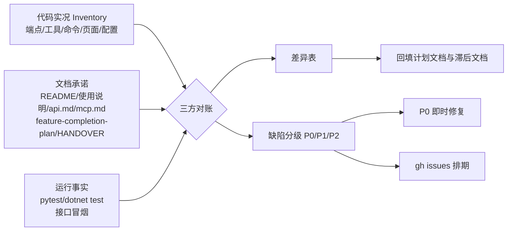

## 产品概述

对 DocMind 桌面知识库软件（Python 后端 + WPF 客户端 + CLI + MCP）做一次**全量功能业务实现度审查**。这不是开发新功能，而是一次"体检式"审计：搞清楚**软件宣称有什么、代码实际有什么、跑起来是否真的能用**，并把三者之间的差距以结构化清单交付出来。

审查对象为当前工作区现状（**包含大量未提交改动**，不以上一次提交版本为准）。

## 核心功能（审查范围与内容）

1. **代码侧能力盘点（先盘实际）**

- 后端：`src/doc2mind/server/http.py`（45 个 HTTP 端点）、`server/mcp.py`（14 个 MCP 工具）、`cli.py`（14 个命令 + model 子命令）
- 客户端：`DocMind/Services/IDoc2kbApiService.cs`（40 个接口方法）、9 个页面与 13 个 ViewModel
- 产出结构化能力清单：端点 / 工具 / 命令 / 页面 / 配置项 五张表

2. **核心链路深度审查（用户点名重点）**
摄入（loader 8 种格式）→ 分块（表格/代码保护）→ 嵌入（ONNX）→ 存储（sqlite-vec）→ 检索（BM25 + 向量 RRF 融合）→ RAG 对话（rag.py + llm/，含 SSE 流式）→ 会话持久化（chat_store.py + `/v1/chats*`）

3. **双向对账（文档 vs 实况）**

- 文档承诺了但代码没实现（虚假宣传）
- 代码已实现但文档没记载（能力埋没）：已发现明确信号——`feature-completion-plan.md` 把"知识图谱""文件监控"标为 P3 未实现，但 `GraphView`/`GraphViewModel`/`/v1/graph/*`（8 个端点）/`file_watcher.py` 均已存在；使用说明缺"对话页""知识图谱页"章节；README 称 MCP 暴露 7 个工具、AGENTS.md 称 11 个、实际 14 个
- 后端有端点但客户端没调用 / 客户端调用了后端不存在的路径（死链）

4. **运行验证（不只看代码）**

- 执行 `pytest` 与 `dotnet build/test`，核实测试是否真实通过、是否存在"假绿"测试（断言恒真、mock 遮蔽真实逻辑、skip 堆积）
- 启动后端做接口冒烟：`/v1/health`、`/v1/ingest`、`/v1/search`、`/v1/chats`、`/v1/graph/*`、`/v1/convert` 等

5. **交付物**

- 审计报告（能力矩阵 + 差异表 + 缺陷分级 P0/P1/P2 + 修复建议）
- GitHub Issues（带标签与验收标准）
- 顺手修复 P0 阻塞缺陷（崩溃 / 死链 / NotImplemented 桩 / UI 空壳）
- 回填 `feature-completion-plan.md`、`HANDOVER.md` 的真实完成度，并补齐滞后文档

## 技术栈（审查作业所依赖的现有工具链）

| 用途 | 工具 | 说明 |
| --- | --- | --- |
| 后端测试 | `python -m pytest tests/ -q` | 28 个测试文件 |
| 客户端测试 | `dotnet build` + `dotnet test DocMind.Tests` | 12 个测试文件 |
| 代码风格 | `ruff check src tests` | 已知遗留 46 项 lint |
| 接口冒烟 | `python -m doc2mind serve` + `Invoke-RestMethod`（PowerShell）或 `curl` | 默认 `127.0.0.1:8765` |
| 问题跟踪 | `gh` CLI | 遵循 `docs/agents/issue-tracker.md` 与 `docs/agents/triage-labels.md` |
| 经验沉淀 | `mcp__doc2mind__search` / `ingest_text` | 审查结束后按 AGENTS.md 约定提出入库建议 |


## 实现方案（审查方法论）

采用**三层对账法**：代码实况（Inventory）↔ 文档承诺（Docs）↔ 运行事实（Runtime），三者不一致处即为审查发现。



**关键决策与权衡**

1. **先盘点后对账，而非直接按文档逐条查**：文档已被证实滞后于代码（知识图谱/文件监控/creative 导出均属此列）。若以文档为唯一基线，会产生大量"文档没写 → 判定未实现"的假阳性。因此第一阶段产出的是"代码真实能力清单"，第二阶段才把它与文档做双向 diff，同时输出"承诺未实现"与"实现未记载"两个方向。
2. **冒烟测试必须隔离环境**：真实知识库位于 `%LOCALAPPDATA%\doc2mind\doc2mind.db`，冒烟会写入数据。一律通过 `DOC2MIND_*` 环境变量指向临时目录 + 临时集合名（如 `smoke-20260829`），结束后删除临时目录，**严禁污染用户真实知识库**。
3. **P0 修复严格限缩**：只修"阻塞性"缺陷（崩溃、死链、NotImplemented 桩、UI 空壳命令），不做重构、不动架构、不顺手改 lint，避免审查任务膨胀成重构任务并把 working tree 弄得更乱。
4. **不擅自 git 提交**：工作区已有大量未提交改动，审查阶段的修改保持为未提交状态，由用户自行决定提交时机。

## 执行注意事项（防踩坑）

- **基线是工作区而非 HEAD**：所有 `NotImplementedError` 扫描显示仅存在于抽象基类（`llm/base.py`、`embedder/base.py`、`loader/base.py`、`chunker/base.py`），属正常设计，不算缺陷——避免误报。
- **重点易断点**：`DocMind/Resources/GraphTemplate.html` 与 `GraphViewModel.cs` 之间的 WebView2/HTML 模板契约（JS 桥接方法名、JSON 字段命名策略 `SnakeCaseNamingPolicy`），是知识图谱页最易断裂处。
- **测试真实性核查**：检查 `tests/` 与 `DocMind.Tests/` 是否存在 `skip`、`Assert.True(true)` 式断言、Fake 服务（`FakeDoc2kbApiService.cs`）是否覆盖了本该被测的真实逻辑。
- **配置项闭环**：核对 `AppSettings.cs` ↔ `appsettings.json` ↔ `core/config.py` ↔ `SettingsView.xaml` 四方是否一致，重点查"UI 有入口但代码不读"和"代码读了但 UI 无入口"（如自动导入目录、启动选项、`DOC2MIND_RAG_MAX_HISTORY_TURNS`）。

## 目录结构

```
docs/audit/
├── 2026-08-29-功能实现审计报告.md   # [NEW] 主报告：能力矩阵（5 张盘点表）、文档vs实现差异表、
│                                    #      缺陷分级清单（P0/P1/P2 含文件行号与修复建议）、
│                                    #      测试与冒烟验证实录、结论与优先级建议
└── issues-待建清单.md               # [NEW] 待建 GitHub Issue 草稿：标题/正文/标签(triage 5 选 1)/
                                     #      验收标准，供用户确认后批量 gh issue create

docs/feature-completion-plan.md      # [MODIFY] 按真实完成度回填 P1/P2/P3 勾选状态与日期
HANDOVER.md                          # [MODIFY] 更新"已交付能力""技术债与风险""测试基线"三节
docs/使用说明-每个页面在干嘛.md        # [MODIFY] 补「对话页」「知识图谱页」「创作导出」章节，修正过时描述
README.md                            # [MODIFY] 修正 MCP 工具数量、补全 graph/curate/models/config 等命令
docs/api.md                          # [MODIFY] 补齐未记载端点（/v1/graph/*、/v1/creative/*、/v1/curate、
                                     #      /v1/system/*、/v1/chats*、/v1/ingest/text、/v1/ingest/job）
docs/mcp.md                          # [MODIFY] 同步 14 个 MCP 工具的真实参数与返回
```

P0 修复涉及的具体源码文件在审查完成后确定，届时以实际缺陷清单为准（预期集中在 `server/http.py`、`ViewModels/*.cs`、`Services/Doc2kbApiService.cs`）。

## 关键产物结构（审计报告的表格契约）

```markdown
### 能力盘点表（端点 / 工具 / 命令 / 页面 / 配置项 各一张）
| 名称 | 位置(文件:行) | 实现状态 | 对应客户端调用 | 文档记载 | 备注 |

### 差异表
| 项 | 来源 | 方向(承诺未实现 / 实现未记载) | 等级 | 建议动作 |

### 缺陷清单
| ID | 等级 | 模块 | 文件:行 | 现象 | 影响 | 修复建议 |
```

等级定义：**P0** 崩溃/数据丢失/核心链路不通；**P1** 功能不可用或结果与预期显著不符；**P2** 体验/一致性/文档问题。

## Agent Extensions

### SubAgent

- **code-explorer**
- 用途：跨 `src/doc2mind/`（73 个 .py）与 `DocMind/`（80 个 .cs + 14 个 .xaml）做大范围事实采集——抽取端点/工具/命令/接口方法清单、追踪核心链路调用关系、定位客户端与后端的调用对应
- 预期产出：完整无遗漏的能力盘点清单与调用链证据（文件:行）

### Skill

- **code-review**
- 用途：对核心链路（摄入→分块→嵌入→存储→检索→RAG→会话持久化）与 9 个页面 ViewModel 做正确性、健壮性、资源管理、安全性审查，识别假绿测试与死链
- 预期产出：按 P0/P1/P2 分级的缺陷清单，含文件行号、根因与修复建议

- **doc-writer**
- 用途：撰写审计报告主文档，并回填 `feature-completion-plan.md`、`HANDOVER.md`、使用说明、README、api.md、mcp.md
- 预期产出：结构清晰、可执行的审计报告与同步后的项目文档