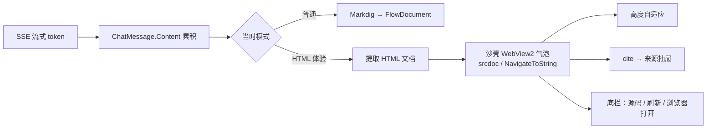

# HTML 对话体验：HTML 即气泡 — v3 薄规格

> **状态**：规划稿 v3（取代 v1 预制组件、v2 重型引擎）。
> **一句话**：输入栏可切换「普通对话 / HTML 体验」；**HTML 体验下助手气泡本身就是一整页活的 HTML**（公式、画图、示波器、动画都在气泡里），不是另开预览窗。
> **设计取向**（已对齐）：不预制内容形态、不做重型本地引擎；AI 自由写自包含 HTML，软件只做 **模式开关 + 抠 HTML + 沙箱气泡**。业界同类均为薄拼装（见文末调研）。

---

## 1. 产品形态

```text
┌─ 输入栏 ─────────────────────────────────────┐
│ [普通对话] [HTML 体验]     ← 模式开关（可记忆） │
└──────────────────────────────────────────────┘

普通对话：助手气泡 = Markdown 文字流（现状）
HTML 体验：助手气泡 = 活的 HTML 文档（沙箱 WebView2）
用户气泡：两种模式都是纯文本胶囊（不变）
```

- **体验功能**：默认「普通对话」；「HTML 体验」用户显式打开。
- **会话内混排**：允许——先开 HTML 模式问一条，再切回普通；每条助手消息按**发出时的模式**渲染，互不污染。
- **导出**：普通对话仍导出 MD；HTML 体验导出 `回答.html`（气泡内 HTML 原文）+ 可选截图。

---

## 2. 两种模式对照

| | 普通对话（默认） | HTML 体验 |
|---|---|---|
| 模型输出 | Markdown | **单个自包含 HTML** |
| 助手气泡 | FlowDocument（Markdig） | **WebView2 整页 HTML** |
| Token | 现状 | 更高（用户自选） |
| 公式 `$...$` | 可选后续增强 | 气泡内用 KaTeX/MathML/ SVG，AI 自决 |
| 引用 `[n]` | 现状角标 | 气泡内链接/角标 → 唤起来源（`postMessage`） |
| 实现量 | 几乎不动 | 薄：开关 + 提取 + 沙箱宿主 |

---

## 3. HTML 体验：输出契约（给模型的规则，要短）

### 3.1 产出形态

- **一个完整、自包含的 HTML 文档**（含 `<style>` / 可选 `<script>`），放在：

```html
```html
<!DOCTYPE html>
<html lang="zh-CN">
...整页内容...
</html>
```
```

- 若模型漏写围栏：客户端从首个 `<!DOCTYPE` 或 `<html` 起截到文末；仍失败则把整段当 HTML 片段包一层宿主壳。
- **内容完全自由**：排版、Canvas/SVG 示波器、图表、动画、交互，均由 AI 决定；软件不预制组件清单。

### 3.2 资源策略（二选一，待拍板）

| 策略 | 做法 | 优点 | 缺点 |
|---|---|---|---|
| **A. 允许 CDN**（推荐体验期） | 可引用 `cdn.jsdelivr.net` 等上的 Chart.js / KaTeX / Mermaid / GSAP | AI 好写、效果强 | 无网时依赖失败 |
| **B. 强制内联** | 只许内联 CSS/JS，或仅用本地白名单库 | 完全离线 | AI 要内联库，token/体积大 |

体验期建议 **A**，并在气泡底栏提示「含在线库」；设置里可强制 B。

### 3.3 Prompt 模式块（追加在 system，HTML 体验轨）

```text
【HTML 体验模式】本轮回答必须输出「一个完整自包含 HTML 文档」，用 ```html 围栏包裹。
要求：
1. 所有可见内容（标题、正文、公式、图表、动画）都写进这一份 HTML；
2. 布局与表现形式由你根据知识形态自由决定（分栏、卡片、Canvas 示波器、SVG 图、时间轴等均可）；
3. 可使用 CDN 库（Chart.js / KaTeX / Mermaid 等）或纯内联；
4. 禁止外链图片追踪、禁止引用用户本地文件；
5. 正文里如需引用资料，使用 <a class="cite" data-n="1">[1]</a>；
6. 不要输出 HTML 以外的大段解说；说明写在页面里。
```

（普通对话轨**不**注入此段，保持 MD。）

### 3.4 Token

- 相对纯 MD：HTML 体验通常 **+40% ~ +150%**（自包含整页）。
- 因是**可选体验**、用户知情，可接受；多轮历史建议只回灌 **纯文本摘要**（避免 HTML 复利），实现时单独一条。

---

## 4. 客户端流水线



### 4.1 提取

```text
优先：```html … ``` 围栏
否则：自 <!DOCTYPE 或 <html 起至文末
否则：整体包 <html><body>…</body></html>（当 fragment）
```

流式未闭合围栏时：已识别部分可先渲染（见 §5）；终帧 `onDone` 强制整页重载（对齐现有 Markdown 终帧 refresh）。

### 4.2 HTML 气泡控件 `HtmlAnswerBubble`

对齐现有 WebView2 用法（`GraphView` / `PdfCitationViewer`）：

| 能力 | 做法 |
|---|---|
| 宿主 | `WebView2`，虚拟主机可选 `https://answer.docmind.local/` |
| 注入 | `NavigateToString` 或 `SetVirtualHostNameToFolderMapping` + 内部页 |
| 沙箱 | 关闭外部下载；CSP：按策略 A 放行 CDN 脚本，或策略 B 仅 `'unsafe-inline'` 本地 |
| 高度 | JS `scrollHeight` → `postMessage` → WPF 设气泡高度（上限可滚动） |
| 引用 | `a.cite` click → `postMessage` → `SourceSearchRequested`（对齐 `WireSourceMarkers`） |
| 底栏 | 「查看源码」「在浏览器打开」「复制 HTML」 |
| 降级 | 无 WebView2 Runtime：显示提示 + HTML 源码只读 TextBox（对齐 GraphView 降级文案风格） |
| 回收 | 消息滚出可视区 `Unloaded` 时释放 CoreWebView2（防护对齐 GraphView 注释） |

### 4.3 与普通气泡的切换

`ChatView.xaml` 助手消息模板：

```text
[FlowDocumentScrollViewer]  ← IsHtmlAnswer=False
[HtmlAnswerBubble]          ← IsHtmlAnswer=True
[TextBox 兜底]              ← 保留现状
```

`ChatMessage` 增：`IsHtmlAnswer`（发送时模式快照）、`HtmlPayload`（提取后的文档）、`HtmlSource`（围栏原文）。

---

## 5. 流式时气泡怎么「长出来」（关键体验）

目标：打字机感尽量保留，又不要半截 HTML 闪烁崩版。

### 5.1 推荐：双阶段

| 阶段 | 行为 |
|---|---|
| **S1 收集中**（围栏未闭合 / 无 `</html>`） | 气泡内显示 **轻量进度壳**：标题行「正在生成页面…」+ 已收到的 **纯文本抽取预览**（去标签），或原文字滚动。**不要**反复整页 reload 半截 HTML。 |
| **S2 完稿**（围栏闭合或 `onDone`） | 一次性 `NavigateToString` 整页；之后交互（Canvas 动画等）稳定。 |

阈值：若流式 > N 秒仍在写，S1 底部可显示「已收到 x KB」。

### 5.2 可选增强（P2，可不做）

- **增量 iframe**：每 800ms 把「已闭合的 head+style + 已解析 body 片段」写入 srcdoc，实现近似打字机；成本高、易闪，体验期可不做。
- **分块多页**：若 AI 输出多个 ` ```html ` 块 → 气泡内纵向多张「卡片页」（每块一张 WebView 或单页拼接）。

**v3 默认只做 §5.1 双阶段**，实现简单、稳。

---

## 6. 设置与持久化

| 项 | 默认 | 位置 |
|---|---|---|
| 对话渲染模式 | 普通对话 | 输入栏开关；`AppSettings.ChatRenderMode`（`Markdown` / `Html`） |
| HTML 资源策略 | 允许 CDN | 设置页「对话」分组：`HtmlAllowCdn` |
| 每会话记忆 | 记住最后模式 | 同 `LastChatCollections` 风格 |

发消息时把模式写入该条 `ChatMessage`，历史消息按快照渲染（切模式不影响已发出的回答）。

---

## 7. 实现拆解（可直接派工）

### P0 — 开关 + 气泡壳 + 一次性渲染（约 1～2 天）

1. 输入栏 `[普通对话 | HTML 体验]`，写入 `AppSettings`。
2. HTML 轨 prompt 注入（`prompt_policy` 新增 track 或 flag）。
3. `HtmlAnswerBubble`：WebView2 + 高度 + 底栏（源码/复制/浏览器打开）。
4. 提取逻辑 + 终帧一次性渲染；S1 用「生成中…+文本预览」。
5. 降级：无 WebView2 → 源码 TextBox。

**验收**：HTML 模式问「用一页 HTML 解释动平衡并画个示意」，气泡内直接出现可交互页面；切回普通模式，下一条仍是 MD。

### P1 — 引用桥 + 混排历史 + 导出（约 2～3 天）

1. `a.cite` / `data-n` → 打开来源（与 `[n]` 同事件）。
2. 历史会话载入：按消息快照还原 HTML 气泡 / MD 气泡。
3. 导出 HTML 回答为 `.html`；多轮历史回灌用纯文本摘要（防 token 复利）。
4. 会话内长列表的 WebView2 虚拟化/回收。

### P2 — 可选

- 增量 srcdoc 打字机（§5.2）。
- 强制内联模式（策略 B）。
- 气泡「在新窗口打开 / 全屏」。

---

## 8. 安全（薄但不省）

| 威胁 | 对策 |
|---|---|
| XSS 到主进程 | 气泡是独立 WebView2 文档，不注入 WPF DOM；消息桥 JSON 白名单字段 |
| 外传数据 | 默认断言：禁止 `fetch` 到非 CDN 白名单（CSP）；严格模式可 `connect-src 'none'` |
| 恶意下载/跳转 | 导航锁定在宿主页；`NewWindowRequested` 取消或仅浏览器打开用户点的 http 链接 |
| 历史污染 | HTML 消息存原文文件或 DB 大文本；回灌 LLM 时用纯文本摘要，不把整页 HTML 塞进 prompt |

---

## 9. 与现有代码接缝（实况）

| 现状 | v3 |
|---|---|
| `ChatView` 助手 = FlowDocument + 兜底 TextBox | 旁增加 `HtmlAnswerBubble`，由 `IsHtmlAnswer` 切换 |
| `ChatMessage.UpdateRenderedDocument` | 保留 MD 路径；HTML 路径不走 Markdig |
| `WireSourceMarkers` | HTML 桥复用同一 `SourceSearchRequested` |
| WebView2（Graph / PDF） | 同初始化与 Unloaded 防护模式 |
| `:::artifact` 创作交付物 | **不动**；那是工作台导出，不是对话气泡 |
| `prompt_policy` 轨 | 新增 HTML 体验轨（或 `response_mode=html`） |
| 弱模型 | 没围栏/残缺 HTML → 提取容错 + 仍能显示源码/文本 |

---

## 10. 调研摘要（为何这么薄）

- 同类（corale、companion-for-claude、各类 artifact viewer）均为：**模型产 HTML → 沙箱渲染在对话里**，无重型本地绘图引擎。
- 消毒/隔离用 **DOMPurify** 或（本方案）**独立 WebView2 文档 + CSP**。
- 图表/公式/动画交给 **HTML 生态（Canvas、Chart.js、KaTeX、CSS 动画）**，与「AI 自由组合」一致。

---

## 11. 待拍板（2 个）

1. **资源策略**：体验期允许 CDN（推荐）还是强制内联？  
2. **流式**：v3 只做「收集中文本预览 → 完稿一次渲染」（推荐）还是 P2 增量打字机？
