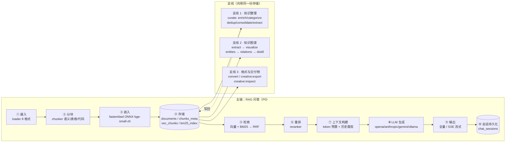
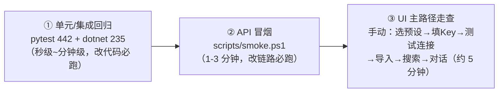

# DocMind 核心链路与卡点验证手册

> 生成日期：2026-08-31
> 面向：接手开发/验证的人或 AI agent
> 定位：回答三个问题 —— **核心链路是什么 / 每个卡点怎么验 / 能不能只用 API 验完**
> 配套可执行物：[`scripts/smoke.ps1`](../../scripts/smoke.ps1)

本文所有端点、字段、行号均以 **2026-08-31 代码实测**为准（`src/doc2mind/server/http.py`，45 个路由），
不以 `docs/api.md` 的转述为准。凡与 api.md 不一致处，已在「六、契约核对与文档漂移」逐条列出。

---

## 一、核心链路

### 1.1 一条主链 + 三条支线



### 1.2 代码入口（改链路时先定位这里）

| 环节 | 入口 | 位置 |
|---|---|---|
| 摄入文件/目录 | `ingest_path()` | `src/doc2mind/core/pipeline.py:64` |
| 摄入文本 | `ingest_text()` | `src/doc2mind/core/pipeline.py:155` |
| 重建索引 | `reindex_store()` | `src/doc2mind/core/pipeline.py:509` |
| RAG 全量问答 | `rag_answer()` | `src/doc2mind/core/rag.py:460` |
| RAG 流式问答 | `rag_answer_stream()` | `src/doc2mind/core/rag.py:561` |
| 上下文与消息组装 | `_build_context_and_messages()` | `src/doc2mind/core/rag.py:846` |
| HTTP 路由总表 | `create_app()` | `src/doc2mind/server/http.py`（45 个路由） |

### 1.3 三层入口共用同一份 core 与同一个库

```
WPF(.NET 8) ──┐
MCP(stdio)  ──┼──► core（pipeline / rag / curator / extractor）──► SQLite 单库
CLI         ──┘        ▲                                    %LOCALAPPDATA%/doc2mind/doc2mind.db
                       │
HTTP API (FastAPI :8765, 45 端点)
```

**这就是「优先用 API 验证」成立的根据**：WPF 与 MCP 都是 core 的薄封装，
API 层验证通过的结论对二者成立；只有**纯前端语义**必须回到客户端验证（见 2.2）。

---

## 二、能不能优先用 API

### 2.1 结论：能，且应当

| 依据 | 说明 |
|---|---|
| 覆盖完整 | 45 个 HTTP 端点，写入链/查询链 100% 覆盖 |
| 有成功先例 | `docs/audit/2026-08-29-功能实现审计报告.md` §3.2：纯 API 冒烟 **19 通过 / 0 失败 / 5 预期 4xx** |
| 可断言 | 判定条件全是 JSON 字段，无需人工看 UI，可直接进 CI |

### 2.2 例外：5 个必须回客户端的卡点

| 卡点 | API 为什么验不出 | 替代验证 |
|---|---|---|
| SSE 客户端取消（AUD-007） | 后端流正常 ≠ 客户端 `ReadLineAsync` 传了 CancellationToken | 手动：生成中停止 / 切换会话 |
| WebView2 图谱双通道重复渲染（AUD-010） | API 层数据完全正确，前端渲两遍 | 手动 + `GraphView.xaml.cs` 走查 |
| XAML 绑定 / ViewModel 状态机 | 纯前端 | `dotnet test DocMind.Tests`（235 项） |
| API Key 的 DPAPI 加解密 | 本地存储语义 | 手动：设置页保存 → 重启 → 测试连接 |
| 会话切换竞态（AUD-001，已修） | 时序只在 UI 交互路径出现 | 手动：流式进行中切换会话 |

---

## 三、卡点验收矩阵

状态约定：**PASS** 通过 ｜ **FAIL** 回归（阻塞）｜ **WARN** 需人工确认 ｜ **SKIP** 前置缺失 ｜ **KNOWN** 已登记缺陷复现（不阻塞）

「脚本项」列对应 `scripts/smoke.ps1` 输出的检查编号。

### 3.1 服务与前置

| 脚本项 | 卡点 | 验证方式 | 通过判定 | 已知风险 |
|---|---|---|---|---|
| 1.01 | 鉴权生效 | 不带令牌请求 `/v1/stats` | **401 UNAUTHORIZED**；带令牌后 200 | `DOC2MIND_DISABLE_AUTH=1` 时匿名放行（仅开发，脚本记 WARN） |
| 1.02 | 健康检查 | `GET /v1/health` | `status=ok` 且 `store_ok=true` | 唯一匿名端点（`http.py:970 _PUBLIC_PATHS`） |
| 1.03 | 嵌入引擎可用 | `GET /v1/health` | `embed_providers` 非空 | 缺失则向量/重排降级 |
| 1.04 | 配置可读 | `GET /v1/config` | 返回 embed_model / llm_provider / rag_top_k | 敏感字段不回显（设计如此） |

### 3.2 写入链

| 脚本项 | 卡点 | 验证方式 | 通过判定 | 已知风险 |
|---|---|---|---|---|
| 2.01 | 建集合 | `POST /v1/collections` | 200 且出现在 stats | 名称仅允许中英文/数字/空格/下划线/连字符 |
| 2.02 | 摄入与分块嵌入 | `POST /v1/ingest` | `ingested[0].chunk_count > 0` | 换嵌入模型后必须 reindex，否则维度不匹配 |
| 2.03 | 摄入幂等 | 同文件再发，`force=false` | `409` **或** `200 + skipped>=1` | ⚠️ api.md 记为 409，实测返回 200+skipped（脚本两种都判过） |
| 2.04 | 文本直入 | `POST /v1/ingest/text` | `ingested[0].chunk_count > 0` | `collection=null` 时允许 AI 自动归类 |
| 2.05 | 落库可观测 | `GET /v1/stats` | `total_documents` / `total_chunks` 同步增长 | — |

### 3.3 检索链（核心卖点）

| 脚本项 | 卡点 | 验证方式 | 通过判定 | 已知风险 |
|---|---|---|---|---|
| 3.01 | 混合召回 | `POST /v1/search` | `total>0`、`degraded=false`、hits 含 vector_score / bm25_score / match_type | 本环境 fastembed 缺失导致 degraded |
| 3.02 | BM25 分量（对照组） | 搜 ≥3 字长词 | `bm25_score > 0` | 对照组失败 ⇒ 关键词索引整体有问题 |
| 3.03 | **AUD-003 短词召回** | 搜 2 字中文词（"气缸"） | `bm25_score > 0` | 🔴 **实测复现**：语料含「气缸缸径」，结果 bm25=0（trigram 仅支持 ≥3 字符） |
| 3.04 | AUD-003 英文缩写 | 搜 2 字符（"IP"） | `bm25_score > 0` | 🔴 同上 |
| 3.05 | min_score 误用提示 | 传 `min_score=0.9` | `message` 非空，指出超出 RRF 量纲 | 实测正常提示「超出 RRF 融合分数范围（0 ~ 0.0328）」 |

> **AUD-003 是全项目性价比最高的修复项**：它让 README 主推的「向量 + BM25 双引擎」在 2 字中文词上
> 静默退化为纯向量，且用户与 UI 均无感知。脚本 3.03/3.04 就是它的常驻回归探针 ——
> 修好后这两项会从 KNOWN 自动翻绿为 PASS。

### 3.4 RAG 主链

| 脚本项 | 卡点 | 验证方式 | 通过判定 | 已知风险 |
|---|---|---|---|---|
| 4.01 | LLM 连通性 | `POST /v1/llm/test` | `ok=true`，`reply_preview` 非空 | 临时客户端、不落盘、不改运行时配置，可反复打 |
| 4.02 | RAG 问答 | `POST /v1/chat` | `answer` 非空 + `sources[].score_type` ∈ rerank/vector/bm25/rrf | 未配 LLM 时必须 **400**（脚本在无 LLM 时改验这条） |
| 4.03 | SSE 流式 | `POST /v1/chat/stream`（`curl.exe -N`） | 帧序 `status → token* → done`，`done.partial=false` | **AUD-006/007**：无全局时长与心跳上限，后端卡死则流不收敛 |
| 4.04 | 首 token 延迟 | 同上，取 `%{time_starttransfer}` | ≤ 8s（云端）/ ≤ 3s（本地） | 云端首次调用偏慢属正常 |
| 4.05 | 会话持久化 | `GET /v1/chats` | 本次 `chat_id` 在列表中，`message_count` 递增 | — |
| 4.06 | 会话消息完整 | `GET /v1/chats/{id}` | `messages >= 2`（user+assistant 成对） | **AUD-008**：两次独立事务，并发下可能错序/缺轮 |
| 4.07 | 多轮续聊 | 带同一 `chatId` 再问 | 返回同一 `chat_id`，且回答用到上轮上下文 | 同 AUD-008 |

### 3.5 支线

| 脚本项 | 卡点 | 验证方式 | 通过判定 | 备注 |
|---|---|---|---|---|
| 5.01 | 质量报告 | `GET /v1/quality` | `total_documents` 与 stats 一致 | ⚠️ spec 期望的 6 个质量字段后端不存在，见第六节 D-08 |
| 5.02 | 文档库 | `GET /v1/documents` | `total` 与摄入数一致 | 支持 collection/q/sort/pageSize |
| 5.03 | 图谱规模 | `GET /v1/graph/stats` | 200 | 节点数取决于是否跑过抽取 |
| 5.04 | 图谱可视化 | `GET /v1/graph/visualize` | 200，返回 nodes/edges | 未抽取时为空属正常 |
| 6.01 | 格式转换 | `POST /v1/convert` | `content` 非空或 `bytes_written>0` | -Deep 档 |
| 6.02 | 交付物导出 | `POST /v1/creative/export` | `ok=true` 且文件真实落盘 | -Deep 档 |
| 6.03 | 重建索引 | `POST /v1/reindex` → `GET /v1/jobs/{id}` | `status=completed` | -Deep 档；换模型后必做 |
| 6.04 | 重建后检索可用 | 重建后再次 `POST /v1/search` | `total>0` | 防「重建后索引损坏」 |
| 6.05 | AI 整理零写入 | `POST /v1/curate` `dry_run=true` | `report.dry_run=true` 且无写入 | -Deep 档，需 LLM |
| 6.06 | 图谱抽取 | `POST /v1/graph/extract` | `extracted_count` 有值 | -Deep 档，需 LLM；**用 Query 参数** |
| 6.07 | 抽取后图谱有节点 | `GET /v1/graph/visualize` | `nodes>0` | -Deep 档，需 LLM |
| 6.08 | 依赖状态 | `GET /v1/system/dependencies` | 200 | -Deep 档 |

### 3.6 功能契约卡点（任务 6 · 2026-09-09）

> 每份契约位于 `docs/specs/功能契约/`，定义前置条件 + 输入契约 + 状态机 + 4 出口 + 完成判据。
> **凡「4 出口」标 ❌ 的功能，该 PR 描述必须附上对应契约并说明破口处理，缺任一项不合并**（规范 `功能契约规范.md` PR 卡点规则）。
> 状态约定同前：✅ 已实现且闭环 ｜ ❌ 有破口（引用 FC 编号，见契约文件）｜ SKIP 前置缺失。

| 功能 | 契约文件 | 4 出口状态 | 关联既有卡点 / smoke 项 |
|---|---|---|---|
| 导入 | `功能契约/导入.md` | 成功✅ · 失败❌(FC-08) · 取消❌(FC-01a/01b) · 空态✅ | 2.01–2.05、3.x；取消类断言待补（任务 3） |
| 搜索 | `功能契约/搜索.md` | 成功✅ · 失败✅ · 取消✅ · 空态❌(FC-07) | 3.01–3.05 |
| 对话 | `功能契约/对话.md` | 前置✅(FC-02) · 成功✅ · 失败❌(FC-03) · 取消✅ · 空态✅ | 4.01–4.07 |
| 设置保存 | `功能契约/设置保存.md` | 成功❌(FC-04) · 失败✅ · 取消✅ · 空态✅(FC-05) | 1.04 配置可读 |
| 知识图谱 | `功能契约/知识图谱.md` | 前置❌(FC-06) · 成功✅ · 失败⚠️ · 取消✅ · 空态✅ | 5.03/5.04、6.06/6.07 |
| 质量看板 | `功能契约/质量看板.md` | 成功✅ · 失败✅ · 取消✅ · 空态✅（「AI 整理」LLM 前置预检查 ⚠️，未编号，见契约前置条件） | 5.01、6.05 |

**诊断口诀（改任一功能时逐句自问）**：做完用户看到什么？做失败用户下一步点哪里？取消后系统留了个什么状态？没数据时显示的是空态还是错误？

---

## 四、分层验证策略与脚本用法

### 4.1 三层验证，按顺序跑



| 层 | 命令 | 何时必须跑 |
|---|---|---|
| ① 回归 | `python -m pytest tests/ -q`（442 通过 / 1 跳过）<br>`dotnet test DocMind.Tests -v q`（235 通过） | 任何代码改动 |
| ② 冒烟 | `scripts/smoke.ps1` | 改动摄入/检索/RAG/会话/端点契约 |
| ③ 走查 | 手动 | 改动前端渲染、配置流、离线恢复 |

> 基线说明（2026-09-02 实测）：pytest **442 通过 / 1 跳过**（watchdog 已安装、文件监控测试已启用；唯一跳过为 SSE 无限流集成测试）、dotnet test **235 通过**。早前的 129/47、306/200 均已过期。

### 4.2 脚本用法

**Windows PowerShell 5.1+（脚本文件为 UTF-8 BOM，中文不乱码）**

```powershell
# 最常用：连接已在运行的后端（WPF 拉起的那个也行）
.\scripts\smoke.ps1

# 最干净：自起后端 + 临时库 + 关鉴权（推荐给 CI）
.\scripts\smoke.ps1 -StartBackend -TempDb -DisableAuth

# 全量：追加支线（转换/导出/重建索引/整理/图谱抽取）
.\scripts\smoke.ps1 -Deep

# 其它
.\scripts\smoke.ps1 -SkipLlm          # 跳过 LLM 相关项（离线环境）
.\scripts\smoke.ps1 -KeepTemp         # 保留临时目录与摄入数据，便于复现
.\scripts\smoke.ps1 -Verbose          # 打印每个请求的 URL/状态码/耗时
```

| 参数 | 作用 |
|---|---|
| `-BaseUrl` | 默认 `http://127.0.0.1:8765` |
| `-StartBackend` | 自行拉起 `doc2mind serve`，退出时自动停止 |
| `-TempDb` | 临时数据库（**仅配合 `-StartBackend` 生效**），绝不碰用户真实知识库 |
| `-DisableAuth` | 设 `DOC2MIND_DISABLE_AUTH=1`（仅开发/测试） |
| `-Deep` | 追加支线验证（耗时更长，含重建索引） |
| `-KeepTemp` | 保留现场 |

**设计要点：**

- **鉴权自动探测**：先不带令牌打 `/v1/stats`，401 则自动读取
  `%LOCALAPPDATA%\docmind\server.token` 并在后续请求带 `X-DocMind-Token` 头；200 则记 WARN（鉴权被关闭）。
- **数据隔离**：默认写入独立集合 `smoke-<timestamp>`，结束自动删除摄入的文档与临时目录。
- **LLM 自适应**：探测不到可用 LLM 时相关项记 SKIP，并改验「未配 LLM 应返回 400」这条降级契约。
- **退出码**：`0` = 无 FAIL；`1` = 存在 FAIL。KNOWN 为已登记缺陷复现，**不计入退出码**，
  因此 AUD-003 未修时 CI 仍是绿的，不会形成「狼来了」。
- **SSE 用 `curl.exe -N`**：`Invoke-WebRequest` 无法逐帧读流；缺 curl.exe 时该项记 SKIP。

**接 CI（GitHub Actions）示例：**

```yaml
- name: API smoke
  shell: pwsh
  run: ./scripts/smoke.ps1 -StartBackend -TempDb -DisableAuth -Deep
```

---

## 五、2026-08-31 本环境实测基线

`scripts/smoke.ps1 -StartBackend -TempDb -DisableAuth -Deep` 实测：

```
PASS 21   FAIL 0   WARN 3   SKIP 8   KNOWN 2   TOTAL 34
```

| 分类 | 项 | 说明 |
|---|---|---|
| WARN | 1.01 鉴权关闭 | 本次用 `-DisableAuth` 主动关闭，符合预期 |
| WARN | 3.01 degraded=True | **fastembed 未安装**，重排不可用（详见第六节 E-01） |
| WARN | 4.01 LLM 未配置 | `llm_provider=openai` 但未填 api_key |
| KNOWN | 3.03 / 3.04 | AUD-003 短词 BM25 零召回，复现成功 |
| SKIP | 8 项 | 全部因无 LLM（chat / SSE / 会话 / curate / 图谱抽取） |

**本环境的三个能力缺口（会影响验证结论的外推）：**

| 缺口 | 影响 | 修复 |
|---|---|---|
| fastembed 未安装（core 依赖 `requirements-core.txt:18`） | 重排不可用 → 检索 `degraded=true`；3.01 只能验到 RRF 层 | `pip install fastembed==0.8.0` |
| 未配置 LLM API Key | chat / SSE / 会话 / curate / 图谱抽取 全部无法验证 | 设置页填写，或 `DOC2MIND_LLM_API_KEY` 环境变量 |
| watchdog 未安装（AUD-021） | 文件监控功能不可用且测试整文件 skip | `pip install watchdog==6.0.0` |

> 结论：**当前环境只能验到「摄入 → 分块 → BM25 检索 → 统计/质量/转换/导出/重建索引」**，
> 「向量检索 / RAG 问答 / 流式 / 会话」需要补齐 fastembed 与 LLM Key 后才能完整验证。

---

## 六、契约核对与文档漂移

编号接续审计报告 `docs/audit/2026-08-29-功能实现审计报告.md` 的 D-01 ~ D-07。
以下为 2026-08-31 编写本手册时**逐行核对 `src/doc2mind/server/http.py` 新发现**的问题。

| ID | 项 | 方向 | 等级 | 说明与建议 |
|---|---|---|---|---|
| **D-08** | `/v1/quality` 缺 6 个字段 | spec 前提错误 | **P1** | `docs/specs/fix-architecture-deficiencies.md` User Story 4 称「后端已返回 `avg_chunk_tokens`/`empty_chunks`/`oversized_chunks`/`duplicate_ratio`/`coverage_by_heading_level`，仅前端补齐映射」。**实测 `src/` 全库搜不到这 6 个字段**，`QualityResponse`（`http.py:797-802`）只有 5 个字段。该 story 不能按「仅前端补齐」实施，须先决定：后端补算 or 修改 spec |
| **D-09** | 摄入幂等返回 | 实现未记载 | P2 | api.md:179 记「409 CONFLICT」，实测 `POST /v1/ingest`（`http.py:1622-1662`）无论文件是否已存在都返回 **200**，用 `skipped` 计数表达跳过。建议：二选一后统一文档与实现（脚本目前两种都判过） |
| **D-10** | `SearchHit` 缺字段 | 实现未记载 | P2 | `SearchHitDTO`（`http.py:758-770`）含 **`rerank_score`**，api.md 的 SearchHit 模型未记载，前端无法消费重排分 |
| **D-11** | curate 动作数 | 实现未记载 | P2 | `VALID_ACTIONS`（`core/curator.py:37`）为 **5 个**（enrich/categorize/dedup/consolidate/**extract**），api.md:602-606 只写 4 个，漏了 extract（知识图谱抽取入口） |
| **D-12** | graph/extract 参数形式 | 实现未记载 | P2 | `POST /v1/graph/extract`（`http.py:2439-2443`）用 **Query 参数** `collection`/`top_k`，**不是 JSON body**。api.md 附录只写了端点名，容易误用 |
| **D-13** | `degraded` 语义 | 实现未记载 | P2 | api.md:212 称 `degraded` = 「嵌入/向量检索不可用，纯 BM25 降级」。实测重排模型不可用时也置位，返回 message 为「重排模型不可用…本次为原始 RRF 排序」。**向量路此时仍可用**，按文档理解会误判为「向量挂了」 |
| **D-14** | MCP 与 HTTP 质量报告不一致 | 双向不一致 | P2 | `mcp.py:357-358` 在无告警且文档非空时追加「未发现质量问题」，HTTP `/v1/quality`（`http.py:2266-2280`）返回空列表。同一份数据两种表现，正是 spec P2-10 要对齐的点 |

**已核对无误、可直接引用的事实（供后续 agent 省去重复核对）：**

| 事实 | 依据 |
|---|---|
| `/v1/health` 是唯一匿名端点 | `http.py:970 _PUBLIC_PATHS = frozenset({"/v1/health"})` |
| 令牌可用 `X-DocMind-Token` 头代替 `Authorization: Bearer` | `http.py:1010-1011`（脚本据此简化请求构造） |
| 环境变量规则为 `DOC2MIND_<UPPER_FIELD>`，覆盖 Settings 的每个 dataclass 字段 | `core/config.py:189-191`（如 `DOC2MIND_DB_PATH`、`DOC2MIND_SERVER_PORT`、`DOC2MIND_RAG_MAX_HISTORY_MESSAGES`） |
| 请求模型同时接受字段名与 camelCase 别名 | 各 Request 类均设 `populate_by_name=True` + `validation_alias`（如 `top_k`/`topK`、`chat_id`/`chatId`） |
| curate 默认 `dry_run=True`，`dedup`/`consolidate` 有损 | `CurateRequest`（`http.py:218-227`） |
| `/v1/chat` 的 `topK` 上限 20，`/v1/search` 的 `top_k` 上限 100 | `http.py:336`、`http.py:243` |
